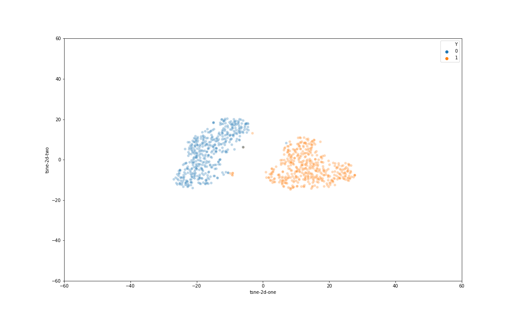

### Summary about performance - 20/03/2020

### Parameters
- Network architecture (applied for all dataset): 136-500-1000-10.
- Learning rate: using default learning rate (0.01).
- Number of shared read for buidling graph: 5 for L, S dataset; 45 for R dataset.
- Maximum seed size: 200.
- LMER: 20.
- KMERS: 4.

|Dataset|Precision|Recall|F1-score|F1 BiMeta|F1 MetaProb|
|-------|---------|------|--------|---------|-----------|
|S1|0.991|0.991|0.991|0.978|0.991|
|S2|0.924|0.924|0.924|0.581|0.901|
|S3|0.969|0.969|0.969|0.978|0.928|
|S4|0.988|0.988|0.988|0.994|0.908|
|S5|0.884|0.884|0.884|0.690|0.823|
|S6|0.994|0.994|0.994|0.858|0.970|
|S7|0.702|0.767|0.733|0.843|0.782|
|S8|0.833|0.581|0.685|0.743|0.769|
|S9|0.727|0.657|0.690|0.791|0.719|
|S10|0.584|0.498|0.538|0.429|0.495|

|Dataset|Precision|Recall|F1-score|F1 BiMeta|F1 MetaProb|
|-------|---------|------|--------|---------|-----------|
|L1|0.982|0.982|0.982|0.980|0.984|
|L2|0.990|0.990|0.990|0.980|0.992|
|L3|0.988|0.988|0.988|0.986|0.993|
|L4|0.991|0.991|0.991|0.987|0.986|
|L5|0.988|0.988|0.988|0.991|0.983|
|L6|0.985|0.985|0.985|0.990|0.984|

|Dataset|Precision|Recall|F1-score|F1 BiMeta|F1 MetaProb|
|-------|---------|------|--------|---------|-----------|
|R1|0.943|0.943|0.943|0.609|0.971|
|R2|0.858|0.858|0.858|0.773|0.968|
|R3|0.814|0.814|0.814|0.780|0.928|
|R4|0.992|0.992|0.992|0.992|0.993|

#### Visualization of Lx dataset

| | | |
|:-------------------------:|:-------------------------:|:-------------------------:|
| L1 seeds' representation | L1 latent groundtruth | L1 latent prediction|
| L3 seeds' representation | L3 latent groundtruth | L3 latent prediction|
| L5 seeds' representation | L5 latent groundtruth | L5 latent prediction|
| L6 seeds' representation | L6 latent groundtruth | L6 latent prediction|

#### Visualization of Rx dataset

| | | |
|:-------------------------:|:-------------------------:|:-------------------------:|
| R1 seeds' representation | R1 latent groundtruth | R1 latent prediction|
| R2 seeds' representation | R2 latent groundtruth | R2 latent prediction|
| R3 seeds' representation | R3 latent groundtruth | R3 latent prediction|
| R4 seeds' representation | R4 latent groundtruth | R4 latent prediction|

#### Visualization of Sx dataset

| | | |
|:-------------------------:|:-------------------------:|:-------------------------:|
| S1 seeds' representation | S1 latent groundtruth | S1 latent prediction|
| S2 seeds' representation | S2 latent groundtruth | S2 latent prediction|
| S3 seeds' representation | S3 latent groundtruth | S3 latent prediction|
| S4 seeds' representation | S4 latent groundtruth | S4 latent prediction|
| S5 seeds' representation | S5 latent groundtruth | S5 latent prediction|
| S6 seeds' representation | S6 latent groundtruth | S6 latent prediction|
| S7 seeds' representation | S7 latent groundtruth | S7 latent prediction|
| S8 seeds' representation | S8 latent groundtruth | S8 latent prediction|
| S9 seeds' representation | S9 latent groundtruth | S9 latent prediction|
| S10 seeds' representation | S10 latent groundtruth | S10 latent prediction|
